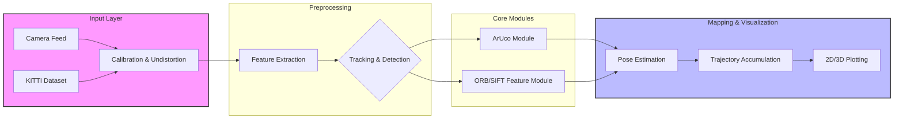

## VSLAM and Object Detection

A comprehensive implementation of Visual Simultaneous Localization and Mapping (VSLAM) concepts, featuring camera calibration, ArUco-based pose estimation, and trajectory mapping using the KITTI dataset.

## Key Features

- Precision Camera Calibration: Maps 3D object points to 2D image coordinates using checkerboard patterns to minimize Mean Reprojection Error.
- Robust Pose Estimation: Utilizes the solvePnP algorithm to calculate camera rotation and translation, specifically optimized for ArUco marker tracking.
- Trajectory Estimation: Integrates the KITTI Vision Benchmark Suite to initialize VSLAM trajectories and visualize camera movement through matched feature pairs.
- Distortion Correction: Employs radial and tangential distortion coefficients to ensure high-fidelity spatial accuracy.

## Project Structure

- Calibration: Scripts for checkerboard detection and reprojection error calculation.
- Detection: ArUco marker tracking and pose estimation logic.
- Mapping: Trajectory plotting and KITTI dataset integration.

## Technical Overview

The core localization logic solves for the camera's extrinsic parameters by minimizing the back-projection error between known 3D points $P_i$ and their 2D projections $u_i$:

$$\sum_{i} \| u_i - \text{project}(P_i; R, t, K) \|^2$$

where $K$ is the Intrinsic Camera Matrix.$R, t$ are the Rotation and Translation vectors.

## System Architecture

## Project Structure

## Dependencies

- Python 3.
- OpenCV (opencv-contrib-python
- NumP
- Matplotlib

## Installation

git clone https://github.com/asundar0128/VSLAM-Object-Detection.git

cd VSLAM-Object-Detection

pip install -r requirements.txt
